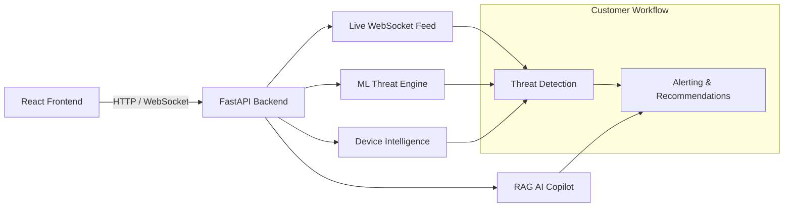

# DANGEN AI Cyber Defense Platform


Enterprise-grade AI security orchestration for modern cyber threat operations.

## 🚀 Project Overview

DANGEN is a modular AI security platform designed to showcase an enterprise-grade engineering workflow for cyber defense. It combines a React/Vite command center with a Python FastAPI backend, real-time WebSocket threat telemetry, machine learning threat scoring, and a RAG-enabled security guidance pipeline.

This repository reflects a startup-ready engineering structure with:
- feature branch guidance
- semantic commit conventions
- production-ready Docker deployment
- GitHub Actions CI validation
- dedicated architecture documentation
- API and ML system documentation
- enterprise Git workflow guidance in `docs/git-workflow.md`

## 🚧 Core Platform Capabilities

- **Neural Threat Telemetry:** WebSocket-based real-time threat feed powering reactive dashboards.
- **AI Threat Scoring:** Ensemble ML threat predictor with anomaly detection and tactical clustering.
- **Security RAG pipeline:** Retrieval-Augmented Generation pipeline for threat intelligence and guidance.
- **Device Intelligence:** IP, URL, and mobile risk analysis based on heuristic and behavioral signals.
- **GeoPulse Radar:** Global threat heatmap and origin analytics backed by simulated darknet telemetry.

## 📌 What’s Included

- `client/` — React + TypeScript attack surface visualization and telemetry command center
- `server/` — FastAPI gateway, ML engines, device intelligence, RAG retrieval logic, WebSocket manager
- `docs/` — Professional architecture, deployment, API, RAG, and ML pipeline documentation
- `.github/workflows/` — CI pipelines for frontend, backend, and Docker validation
- `docker-compose.yml` — Local development and staging orchestration
- `.env.example` — Environment key placeholders for enterprise integration

## 🏗 Architecture at a Glance



## 🧠 Engineering Workflow

### Branching Strategy
Use feature branches for each discrete capability:
- `feature/ai-copilot`
- `feature/rag-pipeline`
- `feature/ml-threat-engine`
- `feature/geopulse-radar`
- `feature/device-intelligence`
- `fix/websocket-reconnect`
- `perf/render-optimization`

### Commit Convention
Use semantic prefixes for clear history:
- `feat:` — new functionality
- `fix:` — bug resolution
- `refactor:` — code restructuring
- `perf:` — performance improvements
- `docs:` — documentation updates
- `chore:` — maintenance tasks
- `build:` — CI or packaging changes

Examples:
- `feat: integrated realtime websocket telemetry`
- `feat: added security guidance pipeline`
- `fix: resolved websocket reconnect instability`
- `perf: optimized Three.js particle rendering`
- `docs: added deployment architecture guide`

## 📚 Documentation System

See `docs/` for detailed coverage:
- `docs/architecture.md`
- `docs/backend-architecture.md`
- `docs/frontend-architecture.md`
- `docs/websocket-system.md`
- `docs/ml-pipeline.md`
- `docs/rag-architecture.md`
- `docs/deployment-guide.md`
- `docs/api-documentation.md`
- `docs/ai-copilot.md`
- `docs/git-workflow.md`

## 🧪 CI / CD Preparation

This repository ships with GitHub Actions validation for:
- frontend build and TypeScript validation
- backend dependency verification and syntax checks
- Docker compose configuration validation

## 🛠 Local Development

### Backend
```bash
cd server
python -m venv .venv
.venv/Scripts/activate
pip install -r requirements.txt
uvicorn dangen_gateway:app --host 0.0.0.0 --port 8000 --reload
```

### Frontend
```bash
cd client
npm ci
npm run dev -- --host 0.0.0.0
```

### Docker Compose
```bash
docker compose up --build
```

## 📈 Roadmap

| Phase | Priority | Outcome |
| --- | --- | --- |
| `feature/ml-threat-engine` | High | Harden predictive threat scoring and alert classification |
| `feature/rag-pipeline` | High | Add enterprise-grade security copilot intelligence |
| `feature/device-intelligence` | Medium | Expand device posture analysis and risk signals |
| `feature/geopulse-radar` | Medium | Add geospatial risk correlation and ASN analytics |
| `perf:render-optimization` | Medium | Improve frontend render performance and reduce bundle size |
| `fix:websocket-reconnect` | High | Harden websocket session failover and reconnection |

## 🔮 Future Enhancements

- Integration with real-world threat feeds: VirusTotal, Shodan, AbuseIPDB
- Vector database persistence with PostgreSQL / Redis / FAISS
- Production SIEM ingestion for Splunk / Datadog / Elastic
- Secure OAuth2 / JWT multi-tenant auth layer
- Automated incident response playbooks and policy orchestration

## 📍 Provenance
This repo is structured to reflect a professional security startup codebase with clear modular separation, reproducible builds, and enterprise-oriented documentation.
