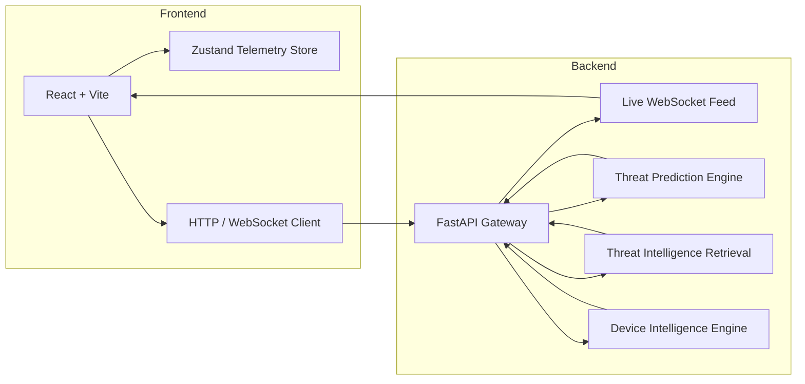

# DANGEN System Architecture

DANGEN is designed as a modular AI-enabled cybersecurity platform with a clear separation between frontend visualization, backend threat orchestration, real-time telemetry, and intelligence retrieval.

## System Layers

- **Frontend** — React + TypeScript command center for telemetry, threat maps, and AI security insights.
- **Backend** — FastAPI gateway exposing REST endpoints, WebSocket feed, ML threat reasoning, and device intelligence.
- **AI / ML** — Ensemble threat scoring, anomaly detection, clustering, forecast simulation, and RAG-based threat intelligence retrieval.
- **Infrastructure** — Docker Compose-ready local orchestration with environment-managed keys and production readiness checks.

## Architecture Diagram

## Documentation Matrix

- `docs/backend-architecture.md` — backend services, router patterns, AI engines.
- `docs/frontend-architecture.md` — React app structure, component modules, and state management.
- `docs/websocket-system.md` — real-time threat stream design and resiliency.
- `docs/ml-pipeline.md` — ML workflows, ensemble prediction, anomaly detection.
- `docs/rag-architecture.md` — threat intelligence retrieval architecture and fallback vector store.
- `docs/deployment-guide.md` — Docker Compose, environment, and GitHub Actions setup.
- `docs/api-documentation.md` — API contract and payload reference.
